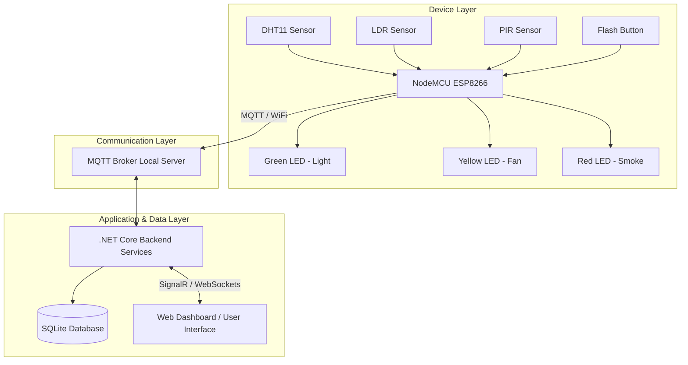

# Smart Home: Context-Aware Smart Living System
## 1. Project Overview
### Description
Local-first IoT smart home. The system focuses on automation, energy efficiency, and security by utilizing context-aware sensors (temperature, light, motion) and real-time MQTT communication. It empowers residents with an interactive, real-time web dashboard for live monitoring and seamless manual override control, bridging the gap between automated efficiency and human comfort.

---
## 2. Problem Statement, Objectives, Scope, and Proposed Solution
### Problem Statement
As urban populations grow, the demand for residential energy efficiency, security, and comfort increases. Traditional homes suffer from inefficient energy use (e.g., lights and HVAC systems running in empty rooms) and lack centralized monitoring. In the context of a developing smart city, individual residential units must become "smart" to contribute to the city's overall energy management and safe-city initiatives.
### Objectives
1. **Energy Conservation:** Automatically control lighting and climate (fans) based on room occupancy and environmental conditions.
2. **Security & Safety:** Monitor entry points (doors) and simulate emergency detection (smoke alarms).
3. **Real-time Interaction:** Provide residents with a low-latency web dashboard for instant monitoring and manual control.
4. **Reliability:** Implement a robust local-server architecture utilizing MQTT for resilient messaging.
### Scope
The project covers a single residential unit (e.g., a "Dining Room") acting as a proof-of-concept. It includes edge hardware (sensors and microcontrollers), an MQTT communication layer, a backend logic/database server, and a frontend web application.
### Proposed Solution
A centralized IoT architecture where a NodeMCU (ESP8266) gathers environmental data and publishes it via MQTT to a local Mosquitto broker. A .NET Core backend subscribes to this data, logs it into a SQLite database, runs intelligent automation rules, and forwards the state in real-time via SignalR WebSockets to a web-based UI. Users can view the data and send manual control commands that temporarily override the automation logic.

---
## 3. System Architecture and Block Diagram
The system operates across three distinct layers: the Device Layer (Hardware), the Communication Layer (MQTT/WiFi), and the Application/Data Layer (Server and UI).

---
## 4. Hardware Components: Sensors and Actuators
### Sensor and Actuator Functions

| Component                          | Type     | Function / Purpose                                                                      |
| :--------------------------------- | :------- | :-------------------------------------------------------------------------------------- |
| **PIR Sensor**                     | Sensor   | Detects human motion in the room to trigger lighting automation.                        |
| **LDR (Light Dependent Resistor)** | Sensor   | Measures ambient room brightness (lux) to determine if artificial lighting is required. |
| **DHT11**                          | Sensor   | Measures room temperature to automate the cooling fan.                                  |
| **Flash Button (GPIO0)**           | Sensor   | Simulates a magnetic door switch to monitor entry/exit points.                          |
| **Green LED**                      | Actuator | Simulates the room's primary lighting system.                                           |
| **Yellow LED**                     | Actuator | Simulates the room's cooling system / Fan.                                              |
| **Red LED**                        | Actuator | Acts as an emergency visual indicator for the simulated Smoke Alarm.                    |
### Inputs and Outputs
| Variable            | Direction | Description / Meaning                                                      |
| :------------------ | :-------- | :------------------------------------------------------------------------- |
| `temperature/value` | Input     | The current room temperature in Celsius.                                   |
| `lightlevel/value`  | Input     | The current room brightness mapped to a lux scale (50-800).                |
| `motion/detected`   | Input     | Boolean (`true`/`false`) indicating if movement is currently detected.     |
| `door/state`        | Input     | String (`OPEN`/`CLOSED`) indicating the state of the room's door.          |
| `smoke/detected`    | Input     | Boolean simulating the detection of hazardous smoke/fire.                  |
| `light/state`       | Output    | Command (`ON`/`OFF`) sent to the microcontroller to toggle the Green LED.  |
| `fan/state`         | Output    | Command (`ON`/`OFF`) sent to the microcontroller to toggle the Yellow LED. |

---
## 5. Test Strategy and Test Cases
### Test Strategy
The system will be tested using a combination of **Unit Testing** (for backend automation logic), **Integration Testing** (verifying MQTT message routing between hardware and software), and **End-to-End (E2E) Testing** (verifying UI updates and manual overrides).
### Selected Test Cases
| Test Case ID | Feature           | Description / Steps                                                                             | Expected Result                                                                                          |
| :----------- | :---------------- | :---------------------------------------------------------------------------------------------- | :------------------------------------------------------------------------------------------------------- |
| **TC-01**    | Motion Lighting   | 1. Cover LDR to simulate dark room (<200 lux).   2. Wave hand over PIR sensor.               | Green LED turns `ON`. UI updates to reflect Light `ON`.                                                  |
| **TC-02**    | No-Motion Timeout | 1. Ensure Light is `ON`.   2. Keep PIR sensor still for 4 consecutive polling cycles.        | Green LED turns `OFF` automatically.                                                                     |
| **TC-03**    | Temp Automation   | 1. Apply gentle heat to DHT11 (exceeding 30°C threshold).                                       | Yellow LED turns `ON`. UI updates to reflect Fan `ON`.                                                   |
| **TC-04**    | Manual Override   | 1. Trigger TC-01 so light turns on via motion.   2. Click "Turn Off" manually on the Web UI. | Light turns `OFF`. A 10-minute "Manual Override" badge appears on the UI, and further motion is ignored. |
| **TC-05**    | Door Toggle       | 1. Press the built-in Flash button on the NodeMCU.                                              | UI immediately updates door status from `CLOSED` to `OPEN`.                                              |
| **TC-06**    | Smoke Simulation  | 1. Wait for random smoke simulation trigger.                                                    | Red LED illuminates. UI flashes emergency smoke warning.                                                 |
